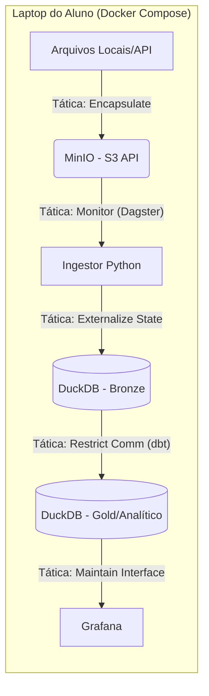

# Revisão Arquitetural: AIOX QA (Baseado em Len Bass)

Esta revisão aplica as **Táticas Arquiteturais de Len Bass** à nossa Modern Data Stack Local, integrando os conceitos de ETL Serverless e Catálogo de Dados.

## 1. Tática: Disponibilidade (Availability)
*   **Detecção de Falhas (Ping/Echo):** Implementação de um "Health Check" no Dagster que monitore a conectividade com o MinIO e DuckDB antes de iniciar o job.
*   **Recuperação (Retries):** Configurar políticas de re-execução (Exponential Backoff) no dbt para falhas de IO no DuckDB.
*   **Ponto de Atenção SRE:** No Learner Lab, a disponibilidade é limitada pela sessão. A arquitetura local deve usar **Checkpoints** (Materialização incremental no dbt) para permitir o reinício de onde parou.

## 2. Tática: Modificabilidade (Modifiability)
*   **Encapsulamento (Use an Intermediary):** Uso do **MinIO** como uma "Landing Zone" (Bronze). O pipeline não lê diretamente da fonte externa; ele primeiro "pousa" o dado. Isso isola o restante do sistema de mudanças na API/Fonte de origem.
*   **Separação de Preocupações:**
    *   **Python/Boto3:** Apenas para Ingestão (Raw).
    *   **dbt:** Apenas para Transformação (SQL).
    *   **DuckDB:** Apenas para Processamento.
    *   **Grafana:** Apenas para Visualização.

## 3. Tática: Performance (Throughput & Latency)
*   **Processamento Vetorizado:** Substituição do Postgres (Linha) pelo **DuckDB (Colunar)** na camada analítica local. Para a pergunta de Receita Líquida (agregações pesadas), o DuckDB é até 100x mais rápido que instâncias t3.micro.
*   **Data Locality:** Manter o arquivo `.duckdb` no mesmo volume onde o dbt é executado para minimizar latência de rede (tática: *Manage Resource Contention*).

## 4. Tática: Segurança (Security)
*   **Confidencialidade:** Uso de variáveis de ambiente (`.env`) e integração com **AWS SSM** (via tática: *Authenticate/Authorize*) para garantir que credenciais do MinIO nunca vazem.

---

## Proposta de Arquitetura Refinada (AIOX QA Edition)

Comparando com o exemplo ClickHouse/Streamlit, nossa arquitetura com **DuckDB/dbt** é mais adequada para o projeto SRE acadêmico devido à facilidade de aplicar **Testabilidade** (dbt tests) e **Linhagem**.

### Diagrama de Fluxo (Táticas Aplicadas)

### Por que esta arquitetura funciona melhor?
1.  **DuckDB vs ClickHouse:** Para o Northwind (dataset pequeno/médio), o DuckDB elimina a necessidade de gerenciar um servidor de banco de dados complexo (é in-process), mas mantém a performance colunar do ClickHouse.
2.  **dbt vs Script SQL Puro:** O dbt aplica a tática de **Testabilidade** nativamente (schema tests, referential integrity), garantindo que a Receita Líquida esteja correta antes de chegar ao Grafana.
3.  **MinIO:** Garante que o código de ingestão seja 100% compatível com a AWS (boto3), facilitando a Etapa 05.

## Resposta à Pergunta de Negócio (Estratégia Técnica)
*   **Modelo Físico:** Criaremos uma View `v_net_revenue_by_product` no dbt.
*   **Lógica:** `SUM(UnitPrice * Quantity * (1 - Discount))`.
*   **Performance:** Usaremos índices (se necessário) ou apenas a natureza colunar do DuckDB para o ranking de Top 10 e a série temporal mensal.

---
**Revisão QA AIOX:** Aprovada com as ressalvas de implementação de *Idempotência* no Ingestor Python.
