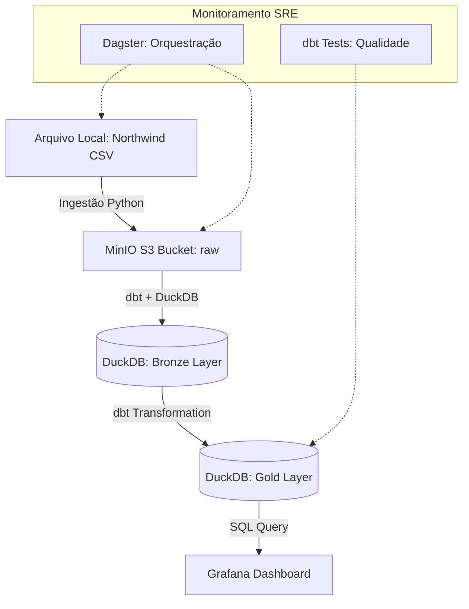

# Design do Sistema: Modelagens e Detalhamento Técnico

Este documento contém o detalhamento da Etapa 03 do projeto, focando na resposta à pergunta de negócio sobre Receita Líquida.

## 1. Modelo Conceitual (Northwind Focus)
O foco está no núcleo de vendas:
- **Produtos (Products):** Entidade que possui nome, ID e categoria.
- **Pedidos (Orders):** Entidade que registra a data da venda (`OrderDate`) e o cliente.
- **Detalhes do Pedido (Order_Details):** Entidade associativa que contém os valores transacionais (`UnitPrice`, `Quantity`, `Discount`).

**Relacionamento:**
`Products` (1:N) -> `Order_Details` (N:1) <- `Orders`

## 2. Modelo Lógico (Camada Analítica - Gold)
Para responder à pergunta de negócio de forma eficiente, utilizaremos uma tabela/view agregada:

### Tabela: `fct_sales` (Fato Vendas)
| Coluna | Tipo | Descrição |
|---|---|---|
| `order_id` | INT | FK para Orders |
| `product_id` | INT | FK para Products |
| `order_date` | DATE | Data da venda |
| `unit_price` | DECIMAL | Preço unitário no momento da venda |
| `quantity` | INT | Quantidade vendida |
| `discount` | DECIMAL | Percentual de desconto (0 a 1) |
| `net_revenue` | DECIMAL | Calculado: `(unit_price * quantity * (1 - discount))` |
| `month_year` | VARCHAR | Formato 'YYYY-MM' para série temporal |

## 3. Modelo Físico (DDL DuckDB/Postgres)
```sql
-- Camada de Staging (Bronze)
CREATE TABLE raw_orders AS SELECT * FROM read_csv_auto('data/orders.csv');
CREATE TABLE raw_order_details AS SELECT * FROM read_csv_auto('data/order_details.csv');

-- Camada Analítica (Gold - Gerada pelo dbt)
CREATE VIEW v_net_revenue_analysis AS
SELECT 
    p.ProductName,
    strftime('%Y-%m', o.OrderDate) as month_year,
    SUM(od.UnitPrice * od.Quantity * (1 - od.Discount)) as total_net_revenue
FROM orders o
JOIN order_details od ON o.OrderID = od.OrderID
JOIN products p ON od.ProductID = p.ProductID
GROUP BY 1, 2;
```

## 4. Diagrama de Arquitetura (Mermaid)


## 5. Táticas SRE Aplicadas (Etapa 04)
1. **Idempotência:** O script Python de ingestão fará um `put_object` no MinIO sobrescrevendo o arquivo, garantindo que a "Landing Zone" seja sempre o estado atual.
2. **Observabilidade:** O dbt gerará um arquivo `manifest.json` que será consumido pelo Dagster para exibir a linhagem dos dados.
3. **Integridade:** Testes de `not_null` e `unique` nas chaves primárias via dbt.
